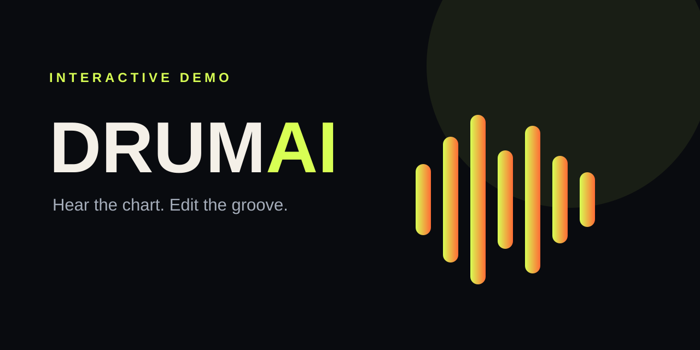

# DrumAI — inspect a drum transcription in your browser



**A zero-backend interactive demo of the notation player produced by a private, CPU-only drum transcription pipeline.**

[Try the demo](https://caio-felice-cunha.github.io/drumai-demo/) · [Read the case study](#case-study) · [Run locally](#run-locally)

## What you can test

- Start a synthesized four-bar drum groove with no audio file or external request.
- Change tempo, toggle the metronome and loop, and edit individual notation steps.
- Switch arrangement emphasis and export the edited chart as JSON.

## Case study

The working private product is a local, CPU-only CLI that turns a song into an
interactive drum chart and MIDI output through a seven-stage pipeline. The
private pipeline runs locally and downloads its model on first use. This public repository deliberately demonstrates the
observable result rather than pretending to run that model in a browser.

The fixture and sound are original and deterministic. No commercial recording,
lyrics, private pipeline source, model, API key, or user upload is included.

## Architecture

```text
Original rhythm fixture → editable grid → Web Audio synthesizer
                                └──────→ JSON arrangement export
```

The browser demo is static HTML, CSS, and JavaScript. It performs no fetch/XHR,
has no account system, and writes nothing to a server.

## Run locally

```bash
npm install
npm run serve
```

Open `http://localhost:4173`. Run `npm run test:all` for unit and browser tests.

## Limitations

- This is a deterministic product demo, not the transcription engine.
- Browser audio starts only after a user gesture.
- Export produces the edited demo arrangement, not MIDI.

## Security and licensing

The code is MIT licensed. Brand and authored case-study assets have separate
rights described in [BRAND-LICENSE.md](./BRAND-LICENSE.md).
